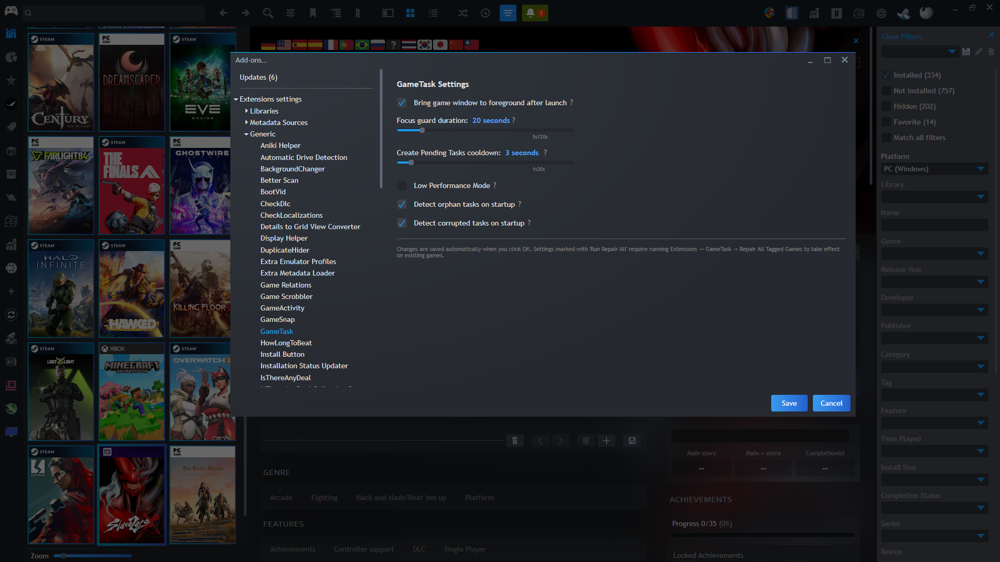
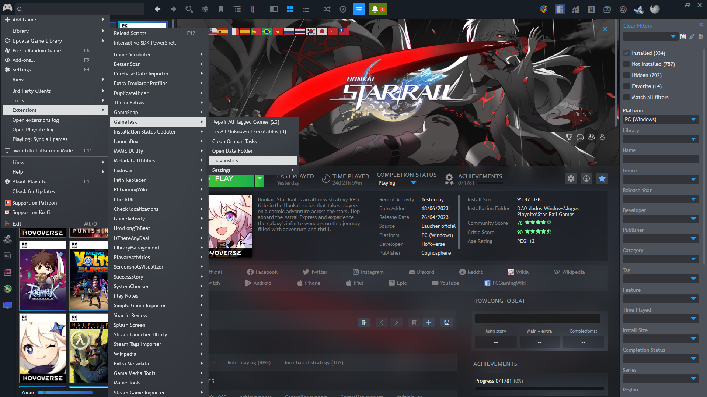
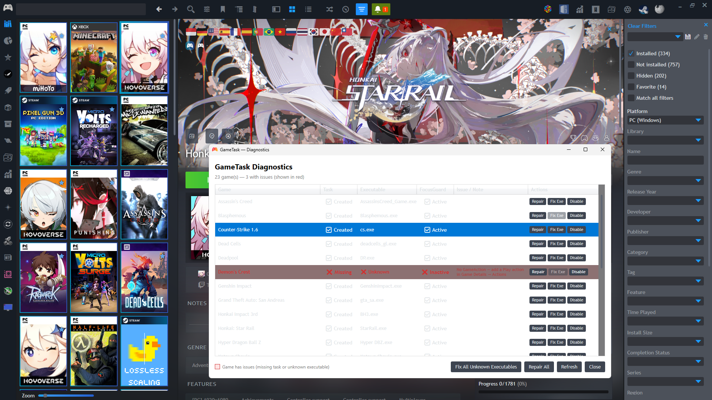

# GameTask

A [Playnite](https://playnite.link/) plugin that lets you launch games **without UAC elevation prompts** by registering them as Windows Scheduled Tasks — giving your setup a console-like feel where games just open, no interruptions.

---

## Screenshots

  
  

  
  

  
  

  
  

  

---

## How it works

When you enable GameTask for a game, it:

1. Creates a small `.vbs` launcher file for the game
2. Sets that launcher as the **Play Without UAC** action in Playnite
3. Registers a **Windows Scheduled Task** that runs the game's `.exe` with elevated rights (`RunLevel Highest`)
4. When you click Play, Playnite calls the launcher → the launcher triggers the scheduled task → the game starts elevated with no UAC popup
5. **FocusGuard** (`GameTask.FocusGuard.exe`) runs simultaneously and brings the game window to the foreground automatically — even over Playnite fullscreen and splash screens

---

## Requirements

- Windows 10 or 11
- [Playnite](https://playnite.link/) 9 or later
- .NET Framework 4.8 (included in Windows 10/11)

---

## Installation

### Option A — Direct download (recommended)

1. Download the latest `.pext` file from the [Releases](https://github.com/TokamiGankei/GameTask/releases) page
2. Double-click the `.pext` file — Playnite will install it automatically
3. Restart Playnite

### Option B — Manual

1. Download and extract the release `.zip`
2. Copy the folder to `%AppData%\Playnite\Extensions\GameTask`
3. Restart Playnite

---

## Usage

### Enabling GameTask for a game

1. Right-click a game in Playnite → **GameTask → Enable GameTask**
2. A notification will appear: *"N game(s) need elevated tasks. Click here."*
3. Click the notification — a UAC prompt will appear **once** to register the task
4. Done. The game will now launch without any further UAC prompts and will automatically come to the foreground

### If the executable is not detected automatically

Some games use launchers or non-standard directory structures:

1. A notification will appear for the affected game
2. Right-click the game → **GameTask → Fix Executable Path**
3. Select the game's main `.exe` (shortcuts `.lnk` are rejected automatically)
4. Click the notification to register the task

### Removing a custom executable path

Right-click the game → **GameTask → Remove Custom Executable Path**

---

## Menu reference

### Right-click menu (per game)

| Menu item | What it does |
|---|---|
| Enable GameTask | Tags the game and sets up the launcher + scheduled task |
| Disable GameTask | Removes the launcher, action, and scheduled task |
| Create Pending Tasks | Runs the elevated helper to register queued tasks |
| Rebuild Selected | Fully removes and recreates everything for the game |
| Repair Selected | Re-applies launcher and action without deleting the task |
| Fix Executable Path | Opens a file browser to manually select the game's `.exe` |
| Remove Custom Executable Path | Clears a manually selected path |
| Open Data Folder | Opens the plugin's data folder in Explorer |
| Open Task Scheduler | Opens Windows Task Scheduler |

### Main menu (Extensions → GameTask)

| Menu item | What it does |
|---|---|
| Repair All Tagged Games (N) | Runs Repair on every tagged game at once |
| Fix All Unknown Executables (N) | Opens file selection for each game with no detected exe |
| Clean Orphan Tasks | Removes scheduled tasks with no matching game in the library |
| Open Data Folder | Opens the plugin's data folder (logs, cache, config) |
| Diagnostics | Opens the Diagnostics window |
| Settings → ... | Quick-access toggles for all settings |

---

## Settings

Accessible via **Settings → Plugins → GameTask** or via the **Extensions → GameTask → Settings** menu (useful in fullscreen mode).

| Setting | Default | Description |
|---|---|---|
| Bring Game to Foreground | ON | FocusGuard brings the game window to the front after launch. Works even over Playnite fullscreen and splash screen plugins. |
| Focus guard duration | 20s | How long FocusGuard keeps the game in the foreground. Increase for games with long loading screens. Range: 5s–120s. |
| Create Pending Tasks cooldown | 3s | Minimum time between two UAC prompts. Prevents accidental double-launch. Range: 1s–30s. |
| Low Performance Mode | OFF | Increases timeouts and push attempts for slow PCs or when many apps are open. Run **Repair All** after changing. |
| Detect Orphan Tasks on Startup | ON | Notifies if the Task Scheduler has tasks with no matching game in the library. |
| Detect Corrupted Tasks on Startup | ON | Notifies if a game's registered `.exe` no longer exists on disk. |

---

## Diagnostics

Accessible via **Extensions → GameTask → Diagnostics**.

Shows a table of all tagged games with:
- **Task** — whether the scheduled task exists in Windows Task Scheduler
- **Executable** — the detected `.exe` for FocusGuard
- **FocusGuard** — whether the window focus feature is active for this game
- **Issue / Note** — explains what is wrong and how to fix it
- **Actions** — per-row Repair, Fix Exe and Disable buttons

Games with issues are highlighted in red.

---

## Steam games

GameTask supports Steam games that use `steam://run/APPID` actions. Instead of a scheduled task, the launcher calls `steam.exe -applaunch APPID` directly. Steam is detected automatically via registry or common installation paths.

---

## Orphan task cleanup

An **orphan task** is a Windows Scheduled Task under `\GameTask\` that no longer has a matching game in your Playnite library — for example, after uninstalling a game without using "Disable GameTask" first.

GameTask detects these automatically on startup (if enabled) and shows a clickable notification. You can also trigger cleanup manually via **Extensions → GameTask → Clean Orphan Tasks**.

---

## Playtime tracking

GameTask uses **Playnite's built-in tracking system** (process name detection). Playtime is recorded automatically as long as the game's main `.exe` is correctly configured.

---

## Troubleshooting

**The game still shows a UAC prompt**  
→ The scheduled task may not have been created. Click the pending notification or go to **Extensions → GameTask → Repair All Tagged Games** and then click the notification.

**No notification appears after enabling**  
→ Go to **Extensions → GameTask → Repair All Tagged Games**, then click the notification that appears.

**The task was created but the game doesn't launch**  
→ Right-click → **GameTask → Fix Executable Path** and select the correct `.exe`.

**The game launches but opens behind other windows**  
→ Make sure "Bring Game to Foreground" is ON. If it still happens on a slow PC, enable **Low Performance Mode** in settings and run **Repair All Tagged Games**.

**I have leftover tasks from removed games**  
→ **Extensions → GameTask → Clean Orphan Tasks**

**The Diagnostics page shows issues for some games**  
→ Use the per-row buttons to Repair, Fix Exe or Disable each game individually.

**Where are the logs?**  
→ **Extensions → GameTask → Open Data Folder** → `Logs\GameTask.log` and `Logs\FocusGuard.log`

---

## Contributing

Pull requests are welcome! Areas that would benefit from help:

- **Advanced playtime tracking** — see `TrackerManager.cs` for ideas
- **Multi-user support** — currently uses `$env:USERNAME` for task principal
- **Support for emulated games** — universal approach for elevation in emulator setups

---

## License

MIT — see [LICENSE.txt](LICENSE.txt)

---

## Support

If GameTask saved you some frustration, a coffee is always appreciated! ☕

