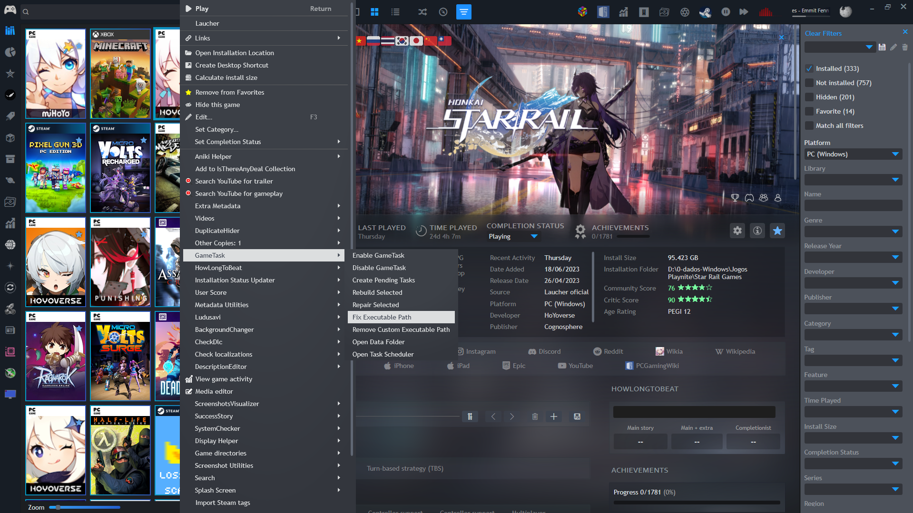
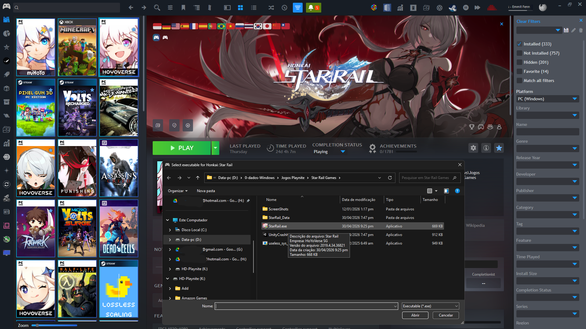
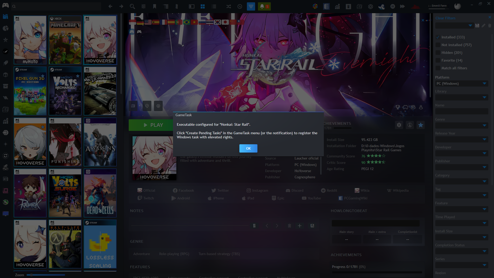
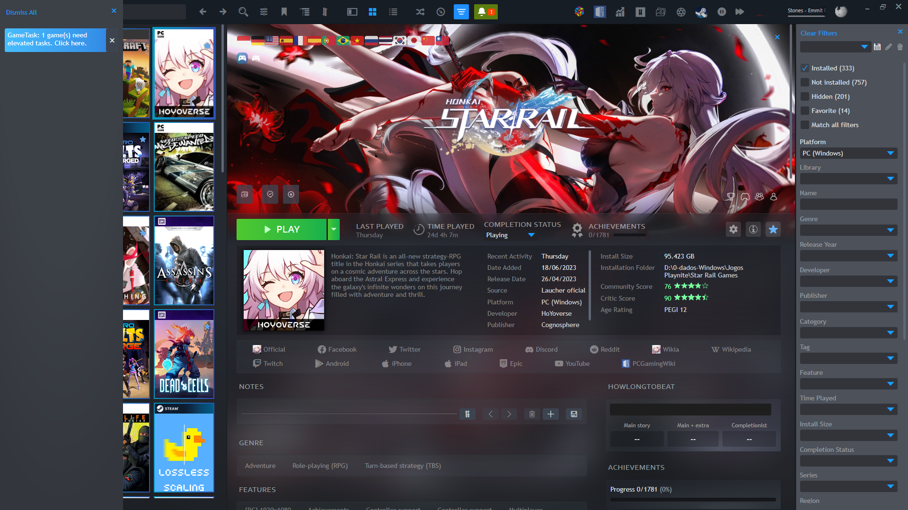
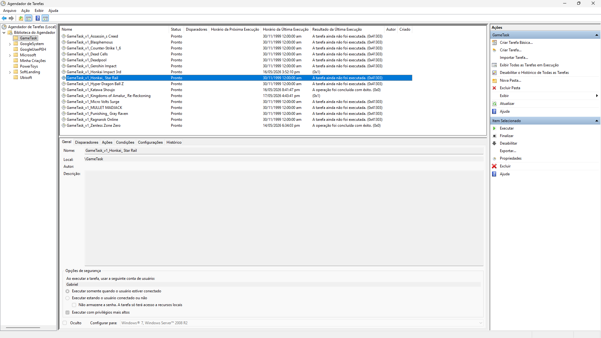
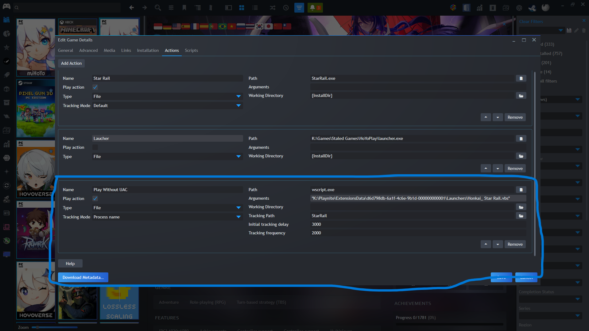

# GameTask

A [Playnite](https://playnite.link/) plugin that lets you launch games **without UAC elevation prompts** by registering them as Windows Scheduled Tasks.

---

## Screenshots

---

## How it works

When you enable GameTask for a game, it:

1. Creates a small `.vbs` launcher file for the game
2. Sets that launcher as the **Play Without UAC** action in Playnite
3. Registers a **Windows Scheduled Task** that runs the game's `.exe` with elevated rights
4. When you click Play, Playnite calls the launcher → the launcher triggers the scheduled task → the game starts elevated, with no UAC popup, and is automatically brought to the foreground

---

## Requirements

- Windows 10 or 11
- [Playnite](https://playnite.link/) 9 or later
- .NET Framework 4.8 (included in Windows 10/11)

---

## Installation

### Option A — Direct download (recommended)

1. Download the latest `.pext` file from the [Releases](https://github.com/TokamiGankei/GameTask/releases) page
2. Double-click the `.pext` file — Playnite will install it automatically
3. Restart Playnite

### Option B — Manual

1. Download and extract the release `.zip`
2. Copy the folder to:  
   `%AppData%\Playnite\Extensions\GameTask`
3. Restart Playnite

---

## Usage

### Enabling GameTask for a game

1. Right-click a game in Playnite
2. Go to **GameTask → Enable GameTask**
3. A notification will appear: *"N game(s) need elevated tasks. Click here."*
4. Click the notification — a UAC prompt will appear **once** to register the task
5. Done. The game will now launch without any further UAC prompts

### If the executable is not detected automatically

Some games use launchers or non-standard directory structures. In that case:

1. A red notification will appear for the game
2. Right-click the game → **GameTask → Fix Executable Path**
3. A file browser will open — navigate to and select the game's main `.exe`
4. A confirmation message will appear, and the pending task notification will show up
5. Click the notification to register the task with elevated rights

### Removing a custom executable path

If you selected the wrong `.exe` and want to reset:

- Right-click the game → **GameTask → Remove Custom Executable Path**

GameTask will then try to detect the executable automatically again.

---

## Menu reference

### Right-click menu (per game)

| Menu item | What it does |
|---|---|
| Enable GameTask | Tags the game and sets up the launcher + scheduled task |
| Disable GameTask | Removes the launcher, action, and scheduled task |
| Create Pending Tasks | Runs the elevated helper to register queued tasks |
| Rebuild Selected | Fully removes and recreates everything for the game |
| Repair Selected | Re-applies launcher and action without deleting the task |
| Fix Executable Path | Opens a file browser to manually select the game's `.exe` |
| Remove Custom Executable Path | Clears a manually selected path |
| Open Data Folder | Opens the plugin's data folder in Explorer |
| Open Task Scheduler | Opens Windows Task Scheduler |

### Main menu (Extensions → GameTask)

| Menu item | What it does |
|---|---|
| Repair All Tagged Games | Runs Repair on every game with the GameTask tag at once |
| Clean Orphan Tasks | Removes scheduled tasks that no longer have a matching game in the library |
| Settings → Bring Game to Foreground | Toggles ON/OFF: automatically focuses the game window after launch |
| Settings → Detect Orphan Tasks on Startup | Toggles ON/OFF: checks for orphan tasks every time Playnite starts |

---

## Settings

Settings are toggled directly from **Extensions → GameTask → Settings** and saved automatically. No restart required for most changes — though toggling "Bring Game to Foreground" takes effect after running **Repair All** so the launchers are regenerated.

| Setting | Default | Description |
|---|---|---|
| Bring Game to Foreground | ON | After launching, GameTask waits for the game process and brings its window to the front. Useful in Playnite fullscreen mode. |
| Detect Orphan Tasks on Startup | ON | On each Playnite startup, compares the library against the Task Scheduler and notifies if orphan tasks are found. |

---

## Orphan task cleanup

An **orphan task** is a Windows Scheduled Task under `\GameTask\` that no longer has a matching game in your Playnite library — for example, after uninstalling or removing a game without using "Disable GameTask" first.

GameTask detects these automatically on startup (if enabled) and shows a clickable notification. You can also trigger cleanup manually via **Extensions → GameTask → Clean Orphan Tasks**. Both methods require a one-time UAC prompt to remove the tasks.

---

## Playtime tracking

GameTask uses **Playnite's built-in tracking system** (process name detection). Playtime is recorded automatically as long as the game's main `.exe` is correctly configured.

> **Note for contributors:** The `TrackerManager` class is reserved for future advanced tracking experiments (child process detection, window title tracking, etc.). See its source code for details.

---

## Troubleshooting

**The game still shows a UAC prompt**  
→ The scheduled task may not have been created yet. Look for the notification in Playnite and click it to run the elevated helper.

**No notification appears after enabling**  
→ Go to **Extensions → GameTask → Repair All Tagged Games**, then click the notification that appears.

**The task was created but the game doesn't launch**  
→ Right-click the game → **GameTask → Fix Executable Path** and point it to the correct `.exe`

**The game launches but opens behind other windows**  
→ Make sure "Bring Game to Foreground" is ON in **Extensions → GameTask → Settings**, then run **Repair All Tagged Games** to regenerate the launchers.

**I want to start over for a game**  
→ Right-click → **GameTask → Rebuild Selected**

**I have leftover tasks from games I removed**  
→ Go to **Extensions → GameTask → Clean Orphan Tasks**

**Where are the logs?**  
→ Right-click any game → **GameTask → Open Data Folder** → `Logs\GameTask.log`

---

## Contributing

Pull requests are welcome! Areas that would benefit from help:

- **Advanced playtime tracking** — see `TrackerManager.cs` for ideas and integration points
- **Multi-user support** — currently uses `$env:USERNAME` for task principal
- **Automatic `.pext` build** via GitHub Actions

---

## License

MIT — see [LICENSE.txt](LICENSE.txt)

---

## Support

If GameTask saved you some frustration, a coffee is always appreciated! ☕

